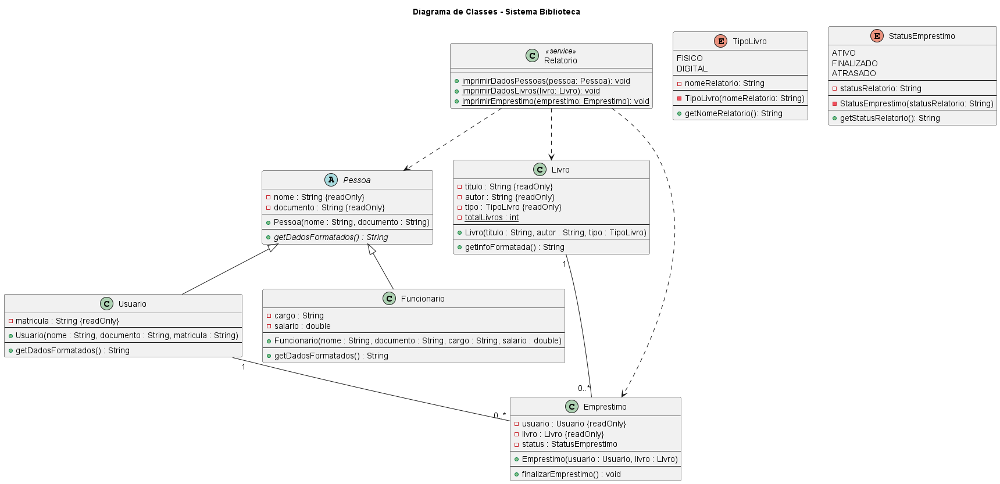
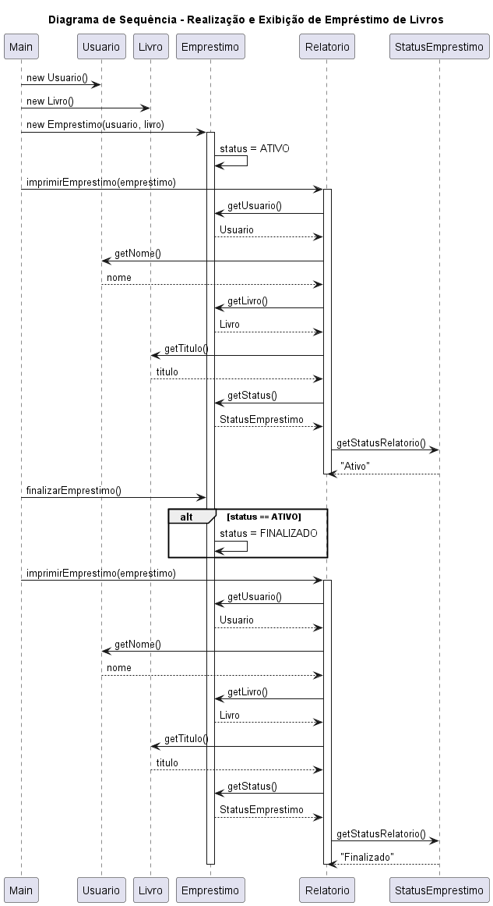
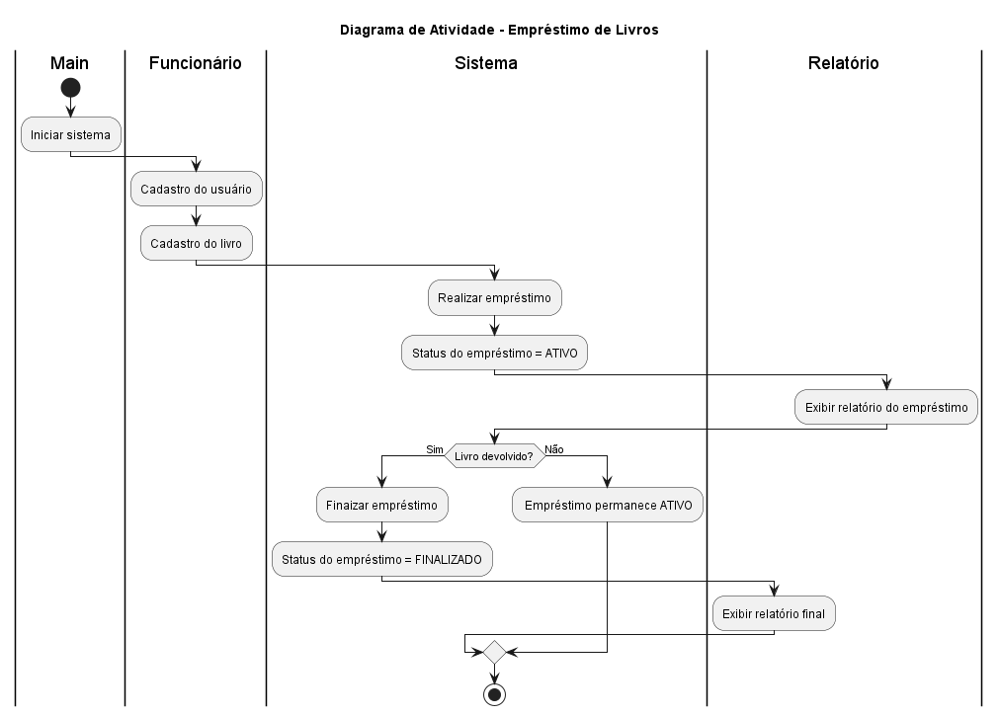
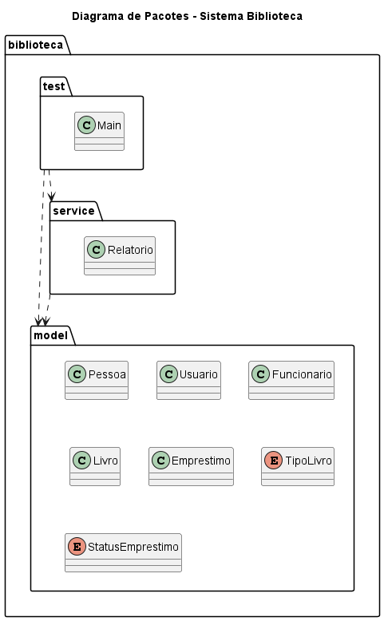
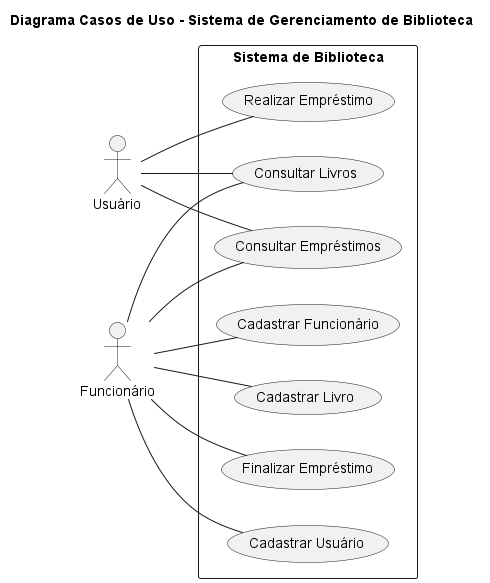

# 📚 Sistema de Biblioteca (Java)

Projeto desenvolvido com o objetivo de praticar **Orientação a Objetos em Java**, aplicando conceitos fundamentais de modelagem e boas práticas de organização de código, com apoio de **diagramas UML**.

---

## 🚀 Funcionalidades

- Cadastro de usuários e funcionários
- Cadastro de livros físicos e digitais
- Realização e finalização de empréstimos
- Controle de status do empréstimo
- Geração de relatórios no console

---

## 🧠 Conceitos aplicados

- Classes e métodos
- Encapsulamento
- Herança e polimorfismo
- Sobrescrita de métodos
- Enumerações com comportamento
- Modificador `static`
- Associação entre classes
- Separação de camadas (`model`, `service`, `test`)
- Modelagem UML (estrutural e comportamental)

---

## 🏗️ Estrutura do projeto

<pre>
src
└── biblioteca
├── model
│ ├── Pessoa.java
│ ├── Usuario.java
│ ├── Funcionario.java
│ ├── Livro.java
│ ├── Emprestimo.java
│ ├── TipoLivro.java
│ └── StatusEmprestimo.java
│
├── service
│ └── Relatorio.java
│
└── test
└── Main.java
</pre>

---

## 📐 Diagramas UML

O projeto foi modelado utilizando **UML**, contemplando diagramas estruturais e comportamentais para melhor compreensão do sistema.

### 🧩 Diagrama de Classes

Representa a estrutura estática do sistema, incluindo:

- Herança entre Pessoa, Usuario e Funcionario
- Associação entre Emprestimo, Usuario e Livro
- Uso de enumerações com comportamento
- Classe de serviço para geração de relatórios

📌 **Arquivo:** `docs/diagramas/classes.png`

📷 Pré-visualização:

### 🔄 Diagrama de Sequência – Empréstimo de Livro

Demonstra a interação entre os objetos durante:

- Criação do empréstimo
- Alteração do status
- Geração do relatório

📌 Arquivo: `docs/diagramas/sequencia-emprestimo.png`

### 🔁 Diagrama de Atividade – Fluxo de Empréstimo

Ilustra o fluxo de atividades do processo de empréstimo, incluindo:

- Início do empréstimo
- Decisão para finalização
- Atualização do status

📌 Arquivo: `docs/diagramas/atividade-emprestimo.png`

### 📦 Diagrama de Pacotes

Apresenta a organização do projeto em camadas, separando:

- Modelos de domínio
- Serviços
- Camada de execução/teste

📌 Arquivo: `docs/diagramas/pacotes.png`

### 👤 Diagrama de Casos de Uso

Mostra as funcionalidades do sistema sob a perspectiva do usuário.

📌 Arquivo: `docs/diagramas/casos-uso.png`

## ▶️ Como executar

1. Clone o repositório
2. Abra o projeto em uma IDE Java (IntelliJ, Eclipse ou VS Code)
3. Execute a classe `Main`

---

## 🔮 Próximos passos

- Implementar camada de serviço (`BibliotecaService`)
- Adicionar validações e exceções
- Criar interface gráfica
- Persistência de dados

---

## 👤 Autor

Allison Bitteti
Projeto desenvolvido para fins de estudo e portfólio.
